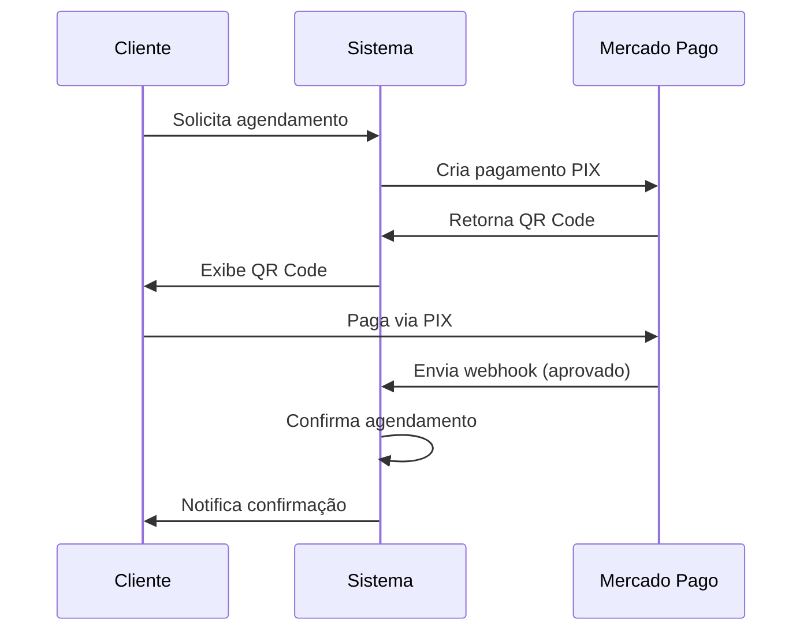

# Integração Mercado Pago - AgendaPro

## 📋 Visão Geral

Integração completa com a API do Mercado Pago para processar pagamentos de agendamentos via PIX e cartão de crédito.

**Autor:** Rafael Dias - doisr.com.br
**Data:** 06/12/2024

---

## 🚀 Funcionalidades Implementadas

### 1. Pagamentos PIX
- ✅ Criação de pagamento PIX
- ✅ Geração de QR Code
- ✅ Notificação automática via webhook
- ✅ Atualização de status em tempo real

### 2. Pagamentos com Cartão
- ✅ Suporte a cartão de crédito
- ✅ Suporte a cartão de débito
- ✅ Parcelamento
- ✅ Tokenização segura

### 3. Gestão de Pagamentos
- ✅ Listagem de pagamentos
- ✅ Filtros por status e método
- ✅ Reembolsos
- ✅ Cancelamentos

### 4. Webhooks
- ✅ Recebimento de notificações
- ✅ Processamento automático
- ✅ Atualização de status de agendamentos
- ✅ Logs de eventos

---

## 📁 Arquivos Criados

### Library
- `application/libraries/Mercadopago_lib.php` - Classe principal de integração

### Controllers
- `application/controllers/admin/Pagamentos.php` - Gerenciamento de pagamentos
- `application/controllers/Webhook.php` - Processamento de webhooks

### Views
- `application/views/admin/pagamentos/index.php` - Listagem de pagamentos
- `application/views/admin/pagamentos/configuracoes.php` - Configurações da API

---

## ⚙️ Configuração

### 1. Obter Credenciais

Acesse o [Painel de Desenvolvedores do Mercado Pago](https://www.mercadopago.com.br/developers/panel/credentials) e obtenha:

- **Access Token** (APP_USR-...)
- **Public Key** (APP_USR-...)

### 2. Configurar no Sistema

1. Acesse: `Admin > Configurações > Aba "Mercado Pago"`
2. Insira o Access Token e Public Key
3. Escolha o modo (Sandbox para testes, Produção para uso real)
4. Salve as configurações

### 3. Configurar Webhook

1. Copie a URL do webhook exibida na página de configurações
2. Acesse: [Configurações de Webhooks](https://www.mercadopago.com.br/developers/panel/webhooks)
3. Adicione a URL copiada
4. Selecione os eventos: `payment`

---

## 💳 Como Usar

### Criar Pagamento PIX

```php
// No controller de Agendamentos
$this->load->library('Mercadopago_lib');

$dados = [
    'valor' => 50.00,
    'descricao' => 'Corte de Cabelo',
    'email' => 'cliente@email.com',
    'nome' => 'João Silva',
    'cpf' => '12345678900',
    'external_reference' => 'agendamento_123'
];

$resultado = $this->mercadopago_lib->criar_pagamento_pix($dados);

if ($resultado['status'] == 201) {
    $qr_code = $resultado['response']['point_of_interaction']['transaction_data']['qr_code'];
    $qr_code_base64 = $resultado['response']['point_of_interaction']['transaction_data']['qr_code_base64'];

    // Exibir QR Code para o cliente
}
```

### Processar Webhook

O webhook é processado automaticamente em `Webhook::mercadopago()`:

1. Recebe notificação do Mercado Pago
2. Busca informações do pagamento
3. Atualiza status no banco de dados
4. Se aprovado, confirma o agendamento
5. Registra log do evento

---

## 📊 Status de Pagamento

| Status | Descrição |
|--------|-----------|
| `pending` | Aguardando pagamento |
| `approved` | Pagamento aprovado |
| `in_process` | Pagamento em processamento |
| `rejected` | Pagamento rejeitado |
| `cancelled` | Pagamento cancelado |
| `refunded` | Pagamento reembolsado |

---

## 🔒 Segurança

### Boas Práticas Implementadas

1. **Tokenização**: Dados do cartão nunca passam pelo servidor
2. **HTTPS**: Todas as requisições via SSL
3. **Validação**: Verificação de assinatura do webhook
4. **Logs**: Registro de todas as transações
5. **Idempotência**: Chaves únicas para evitar duplicação

### Ambiente de Testes

- Use credenciais de teste (Sandbox)
- Cartões de teste disponíveis na [documentação](https://www.mercadopago.com.br/developers/pt/docs/checkout-api-v2/resources/test-accounts)
- PIX de teste é processado instantaneamente

---

## 📖 Documentação Oficial

- [Visão Geral](https://www.mercadopago.com.br/developers/pt/docs/checkout-api-v2/overview)
- [Integração PIX](https://www.mercadopago.com.br/developers/pt/docs/checkout-api-v2/payment-integration/pix)
- [Integração Cartões](https://www.mercadopago.com.br/developers/pt/docs/checkout-api-v2/payment-integration/cards)
- [Webhooks](https://www.mercadopago.com.br/developers/pt/docs/checkout-api-v2/notifications)
- [Reembolsos](https://www.mercadopago.com.br/developers/pt/docs/checkout-api-v2/payment-management/refunds-cancellations)

---

## 🐛 Troubleshooting

### Webhook não está funcionando

1. Verifique se a URL está acessível externamente
2. Confirme que a URL está configurada no painel do MP
3. Verifique os logs em `admin/logs`

### Pagamento não é aprovado

1. Verifique se está usando credenciais corretas (produção/sandbox)
2. Confirme os dados do pagador
3. Verifique o status_detail para mais informações

### Erro de autenticação

1. Verifique se o Access Token está correto
2. Confirme se o token não expirou
3. Verifique se está usando o token correto (produção/sandbox)

---

## 🔄 Fluxo de Pagamento



---

## ✅ Checklist de Produção

- [ ] Credenciais de produção configuradas
- [ ] Webhook configurado e testado
- [ ] HTTPS ativado
- [ ] Logs de erro configurados
- [ ] Testes de pagamento realizados
- [ ] Política de reembolso definida
- [ ] Suporte ao cliente preparado
